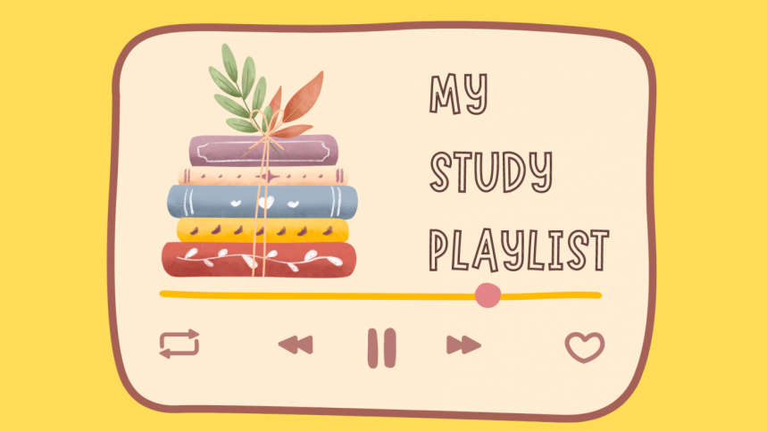

# Personalized Study Music Playlist 

**Proposers**: Justine Afaga & Lewin Lin 

## Overview 
**The Issue**: For many students, studying effectively can hinge on having the right environment and resources. Music can enchance focus, reduce stress, and even boost memory. However, find the right study music for each task can be hard, as one's concentration needs vary depending on the mood, study goals, and workload intensity. While some might benefit from ambient background noise, others may require specific beats or melodies to maintain focus or enter a flow state. As students from UH Manoa, we juggle from multiple academic responsibilities and we often focus a lot on studying, which having an app that simplifies and personalizes our study music can be really helpful. 

**The solution**: This project proposes a "Personalized Study Music Playlist" app that creates a playlists based on each user's study habbits, concentration level, and personal music preferences. By inputting details such as the mood, the study session's purpose (e.g., intense focus vs relaxed music), and time, users will receive a tailored playlist that is designed to enchance productivity and reduce distractions. In addition, the app will allow for adjustments depending on a user concentration needs during a learning session. 

**Special Sauce**: What sets this app apart is its "Mood & Focus Input" system. This would allow users to import their study mood--whether aiming for deep focus, a relaxed vibe, or a motivational push--and receive a tailored playlist that matches not only the purpose of the study, but also the concentration style. In addition, the app uses feedback and sata to change the recommendations over time, learning from each esseion to suggest playlists or songs. By gathering information on which songs are skipped, repeated, or rated highly, the app refines it suggestions to align more with the users need. The "Community Playlists", showcases playlists popular among UH Mānoa students, creating a collaborative, study friendly environment that draws on peer study music. 

## Mockup page ideas 
### 1) Home Screen
- The main dashboard includes the app's features and prompts users to create a playlist for their study session
- Key options include fields for study time, mood selector, and music genre preferences.

### 2) Playlist Generation Screen 
- An easy to read interface where users select their mood and study type, then view a suggested playlist with some titles, artists, and duration.
- Playlist customization options are included, such as "add more tracks" or "inlude classical background music".

### 3) Session tracker and Adjustments 
- As users study, a screen allows them to track time remaining in their session and make adjustments to the music if needed. 
- Options for "less distracting" or "more focus-enchancing" adjustments appear here to refind the playlist based on real-time feedback.

### 4) Community Sharing and Suggestions 
- Users can see what others are listening to for similar study tasks or moods.
- Popluar study playlists for UH Manoa students can be featured, fostering a community-driven approach to an effective study habit. 

## Use case ideas
- **Case 1: Final Exam Prep for Intense Concentration**
Rachel, a student at UH Mānoa has a final exam approaching and needs focus for her study session. She opens the app, selects "Intense Focus", chooses a 3-hour duration, and receives a playlist and instrumental and ambient tracks designed to keep distractions at bay.

- **Case 2: Relaxed Study for Casual Review**
Jon needs a more relaxed study atmosphere while reviewing notes for a less demanding subjects. He selects "Background Noise" with a "Calm" mood, generating a playlist featuring soft acoustic tracks that creates a background sound without requiring intense focus.

- **Case 3: Community Playlist for Group Study**
UH Mānoa students gather for a group study session in the library. They use the "Community Playlist" features to discover popluar playlists for group study. Choosing a collaborative focus playlists, they enjoy upbeath yet non-distracting tracks that enchance their collective study experience. 

## Beyond the basics
The app's real-time adjustment capability and adaptive feedback mechanism allows it to become "smarter" with every session. Through user feedback, such as tracking songs that get repeated, skipped, or rated, the app has its recommendations and constructs a user profile to deliever an accurate and personalized experience. In addition, the "Community Playlists" feature enables students to connect with each other through shared study music, fostering academic support and community based learning. As more students use and contribute to the app, it will grow into a collaborative resource where study-friendly music is curated to meet the needs of the community.
