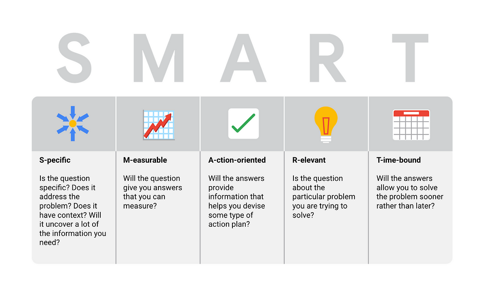

## Stackoverflow Questions 
<b> The Smartest Way: </b> The user asks how to store a hardcoded JSON string into a variable in C#. They provided an example JSON object but are unsure how to properly assign it to a variable in their code. The question is clear but could benefit from details on what they’ve tried or any specific error they’ve encountered.

The Stack Overflow question ["Store Hardcoded JSON string to variable"](https://stackoverflow.com/questions/22998177/store-hardcoded-json-string-to-variable) is a fairly good example of a smart question, but could be improved in alignment with Eric Raymond's guidelines. The user provides a clear problem statement, sample code, and context (C#), but does not show what they have tried or researched beforehand, which would strengthen the question. Despite this, the community provided efficient answers, offering both direct solutions and explanations.

This illustrates how asking a reasonably clear question can result in helpful, relevant responses.

<b> The not so smart way: </b> The user reports an issue with NW.JS where the application does not go fullscreen, despite their efforts to make it work. The problem description lacks details about system setup, attempted solutions, or error messages, making it harder for responders to provide precise help.

The Stack Overflow question ["NW.JS won't get Fullscreen whatever I did"](https://stackoverflow.com/questions/78971218/nw-js-wont-get-fullscreen-whatever-i-did) demonstrates a less optimal example of smart question-asking as per Eric Raymond's guidelines. The user describes the issue but lacks critical details, such as the specific steps already taken, error messages, or system specifications, leading to a somewhat vague inquiry.

The responses reflect the user's vague question, with suggestions offered based on assumptions rather than clear troubleshooting. If the question were more precise and showed more research, the answers could have been more efficient.

## Why Smart Questions Are Important
Smart Questions are important for software engineers since they save time and resources, encourages more collaboration on questions, and a quicker way to problem solving. Asking questions the smart way shows that an individual has made commitment to understand the issue, has done background research, and has the mindset to solve it rather than relying on others to do it for them. This approach promote a culture respect and mutual exchange of knowledge, which is important in the real world of software engineering. 

## What is Considered a 'Smart Question' 
Questions that follow the precepts of smart questions are well research, precise, and demonstrate willingness to collaborate. Like if someone were to ask for help after providing detailed information on their issue, of what they've tried and what resources they've concluded, they are more likely to receive help. To summarize, questions that are vague, poorly constructed, or suggest that the asker has not done any preliminary work tend to be ignored or met with people more likely to ignore the question. 

<b> Research Effort: </b> The asker demonstrates they've looked for solutions--like Googling, referring to other posts, or FAQs.
  <b> Precision: </b> The question is concise and focused on a specific problem. 
  <b> Respectful Attitude: </b> Possibility that there is an understanding that no one may not obligate to help, and the asker approaches the community and professionalism. 

## Poor Questions On the Other Hand: 
  <b> Vague: </b> No clear description of the problem or what has already been done 
  <b> Entitled: </b> The asker behaves as though they are owed an answer without demonstrating effort or respect for the expert's time. 

Smart Responses include the meaningful guidance or direction for further research, while poor responses often result from frustration or a sense of time wasted due to the asker's lack of preparation. Like, if someone receives the response of "RTFM" (Read the F*cking Manual), it is usually since they have not put in the effort to look for solution themselves. Smart responses tend to guide the asker to the right resources, or to help them understand their issue better rather than giving the answer right away. 

## Key Takeaways  
<b> Preparation is KEY! </b>
Asking smart questions requires preparation and effort. Doing preliminary research, attempting a solution, and presenting the problem in a clear manner are all signs of a knowledgeable software engineer. 

<b> Be Collaborative, NOT Entitled </b>
Engineers who see themselves as partners in solving the issue, rather than passive recipients of knowledge, will be more successful in receiving help. 

<b> Show Respect and Efficiency </b>
The 'hacker culture' values respect and efficiency, and those who align with this mindset will integrate better into the community. Good questions save time for everyone involved and a promote a productive environment. 
