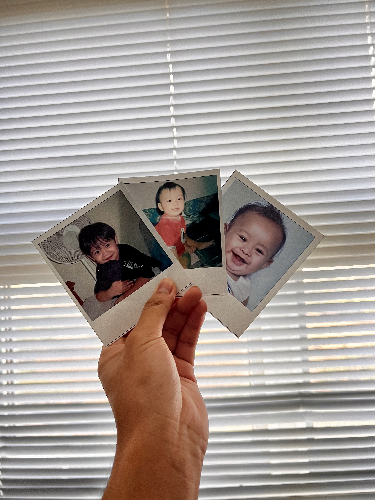
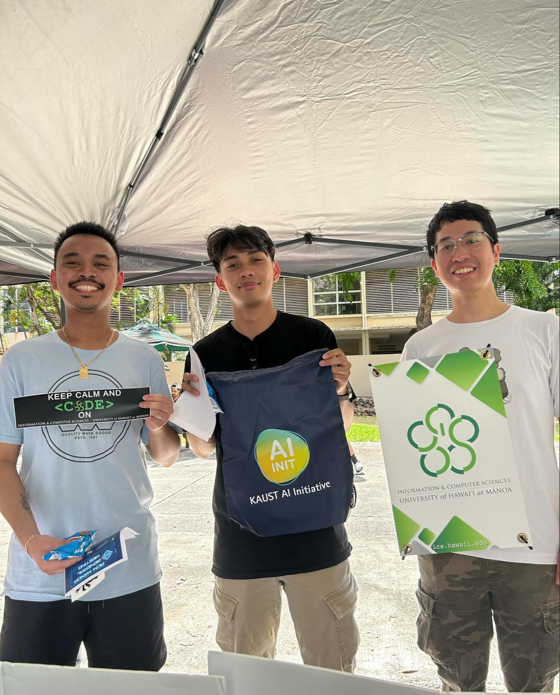

*"Yesterday was history, tommorrow is a mystery, but today is a gift" - Master Oogway*

## The Beginning of My Tech Journey
Growing up as an "iPad kid," I’ve always been fascinated by technology. I spent a lot of time playing around with my iPad and wondering how it worked. I also found it interesting how my mom's phone could be controlled just by touch. These early experiences sparked my curiosity and got me thinking about how these devices were built, leading me to explore classes related to Information and Computer Science, such as software engineering. My parents didn’t really grow up around technology as much. I grew up playing on my mom’s phone, where there used to be a physical keyboard attached to the phone—almost like a miniature computer in your hand. Then, my dad got me a Wii and an iPad, which further intrigued me about technology and how it all worked.

## Steve Jobs: My Inspiration
One person who really inspired me was Steve Jobs. His work with Apple and his vision for technology left a big impact on me. I learned from his book, Jobs didn’t just create cool looking devices back in 2007; he changed the way we interact with technology by making it simple and user-friendly on one device. Watching his impact on the tech world with the creation of the first iPhone made me want to explore into how things like computers and phones function. His focus on pushing the boundaries and being innovative motivated me to pursue computer science in college, and that I would want to help improve a better future.

## From Curiosity to Problem-Solving and Artificial Intelligence
When I first became interested in technology, it was all about figuring out how devices like iPads and smartphones worked. But now, after experiencing and taking classes in computer science, I realize that software engineering is about much more than just how devices function. It's about problem-solving and creating tools that can improve people's lives. Looking back, I didn’t really have a full understanding of why I’m a “tech person” in the first place. Was it because I own the entire Apple ecosystem? Or was it because I knew a lot about software features? It took time to realize what I’m truly interested in goes beyond then just using the products—I’m captivated by how both the hardware and software of computers are built from the start.

One of the fields that interests me the most is artificial intelligence (AI). I find the idea of machines learning and adapting to be really exciting, and I’m eager to explore this area further. As I move forward in my college journey, I’m working toward the goal of joining a major tech company like Apple or Microsoft. These companies have always stood out to me because they’re known for their innovation and leadership in technology. I want to be part of that, whether it’s creating new software, working on AI projects, or developing the next big thing in tech.

Overall, my journey from an "iPad kid" to a computer science student has been driven by curiosity and a desire to understand how technology works. I’m excited about what I’ve learned so far and even more excited about what’s to come. I hope to take everything I learn in college and apply it to a future in the tech industry, where I can make a difference and contribute to the innovations that shape our world.
