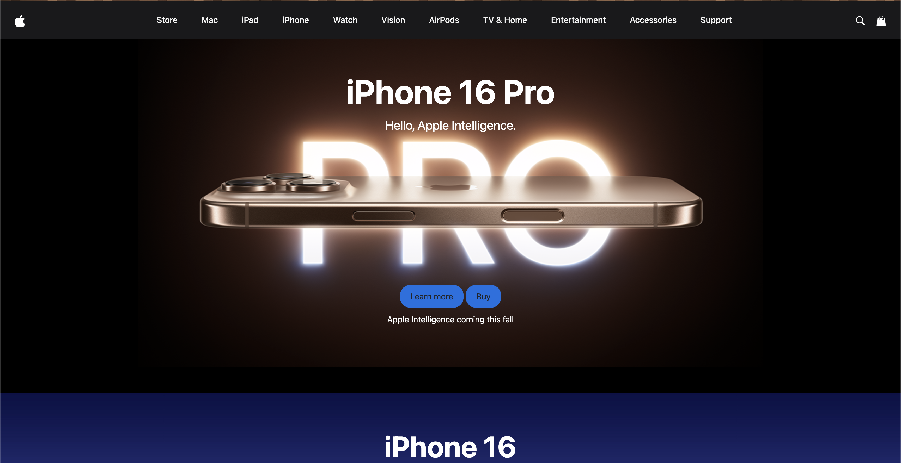
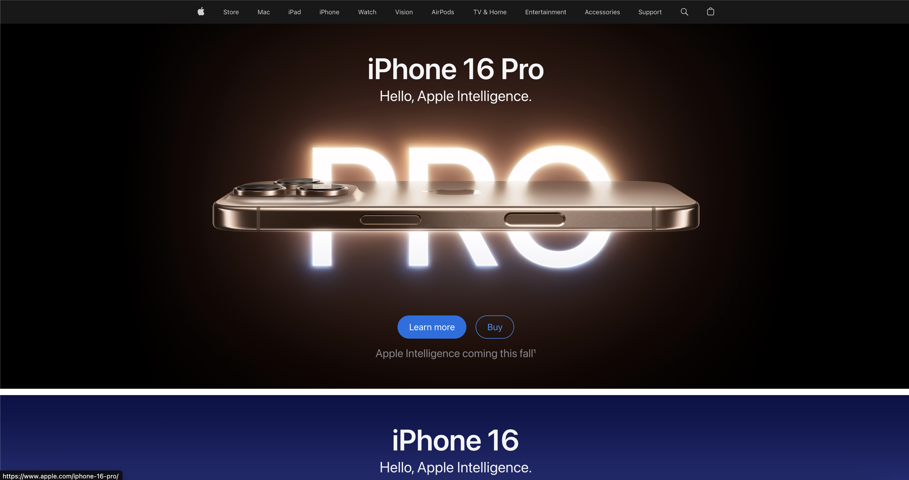

Web development has evolved dramatically from the early days of manually coding every element in HTML and painstakingly styling it through CSS. Today, developers have powerful tools at their disposal that simplify the process of building modern, sleek websites. One such tool I recently explored is Bootstrap. Yet, with the introduction of these frameworks, many might wonder: why bother learning them? Why not stick to the basics of raw HTML and CSS?

## The Benefits of Frameworks
One of the biggest reasons to adopt UI frameworks like Bootstrap 5 is the sheer speed and efficiency they offer. Building a responsive website from scratch using just HTML and CSS can be a slow, tedious process. Frameworks change the game by providing pre-built components and styles, allowing developers to create websites quickly and efficiently without having to reinvent the wheel.

Take Bootstrap as an example. It comes packed with ready-made components like navigation bars, modals, carousels, buttons, and form elements, all designed to work across different browsers and devices. Its grid system is a game-changer, making responsive layouts a breeze, and automatically adjusting the website to fit anything from a small phone screen to a large desktop monitor.
Admittedly, the learning curve of mastering a framework can be challenging. However, once I got comfortable with it, I was able to build website pages in a fraction of the time it would have taken me otherwise. Instead of spending hours on custom CSS, I could style entire elements in just a few lines of code using Bootstrap. Plus, the wealth of documentation and large developer communities make troubleshooting and learning much more approachable.

## Consistency and Maintenance
Another key advantage of using a UI framework is the consistency it brings. Keeping a uniform design across multiple web pages can be difficult, but frameworks like Bootstrap provide a set of standard components and styles that ensure everything looks polished and professional.

Frameworks also make website maintenance easier. Let’s say I need to update the style of a button across an entire site—I can simply modify the framework's default class instead of hunting through a sea of custom CSS. This keeps the code cleaner and less prone to errors, ultimately making the development process more efficient.

## The Challenges of UI Frameworks
Of course, working with UI frameworks isn’t without its challenges. The most obvious hurdle is the steep learning curve. As someone new to web development, the sheer number of components, classes, and utilities in Bootstrap felt overwhelming at first. It’s almost like learning an entirely new language on top of the usual HTML, CSS, and JavaScript.

Another potential downside is customization. While Bootstrap’s pre-built components are incredibly useful, they can sometimes feel a bit restrictive. In a recent assignment where we had to replicate a website using Bootstrap, I was tempted to bypass CSS customization entirely, relying heavily on Bootstrap’s defaults. However, if you have a specific design in mind, bending the framework to fit your vision can sometimes take more effort than building from scratch.

## My Take on Bootstrap 5
Before using Bootstrap 5, I had never ventured into the world of UI frameworks, and I wasn’t sure what to expect. I have to say, though, that I find web development surprisingly more enjoyable than my previous experiences with Java. Initially, grasping Bootstrap’s grid system, classes, and components took time, but once I understood them, I was able to build responsive websites quickly—something that would have taken much longer with just HTML and CSS.

The flexibility and responsiveness of Bootstrap stand out as its greatest strengths. Creating a grid layout that adapts to various screen sizes used to require a lot of custom CSS. Now, with Bootstrap’s responsive classes, like col-md-6 or col-lg-4, I can easily control how much space elements occupy based on screen size.

Despite its many advantages, Bootstrap isn’t perfect. There were moments when I struggled to override default styles for a custom design. However, I found that the time saved using its pre-made components far outweighed these minor challenges.

## Conclusion: Is the Investment Worth It?
Learning a UI framework like Bootstrap 5 is undoubtedly a time investment, especially for beginners like me. However, once I overcame the initial frustrations, the rewards were clear. From speeding up development to ensuring consistent designs, Bootstrap simplifies the web development process in many ways.

In a recent assignment, I was tasked with choosing a website to replicate using Bootstrap, and I selected to replicate apple.com page, specifically the home page, from the Apple's website. This was my first time attempting to replicate a website, which I used my knowledge I learned from Bootstrap re-create the visual complex apple website. If you look at he pictures shown, on the left is the actual Apple website, while the one to the right is the replica website I attempted. The grid system from Bootstrap was kind of confusing at first, but it made it easier to understand how the responsive layout works, and the pre-made components simplified the process of designing elements like the buttons and navigation bars. While there were moments when I had to customize beyond Bootstrap's default styles, the framework’s flexibility gave me a decent strucutre to follow on.

For anyone looking to build professional, responsive websites quickly, I believe Bootstrap 5 is a useful tool. While it may not offer endless customization, its flexibility, strong community support, and extensive documentation make it a powerhouse. In my experience, choosing to work on a UI framework is an investment, and losens up frustration and better websites constructing better.

