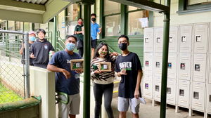

During my senior year of high school, I took on a leadership role by focusing a Career and Technical Education (CTE) project focused on managing a commercial bakery. In celebration of National Cookie Day, I decided to incorporate this theme into my project, as it provided the perfect opportunity to produce a large number of cookies for the school faculty. Since the project took place near the Christmas season, the spirit of giving and appreciation for our teachers and school staff became a central focus. I aimed to show gratitude to those who had provided us in school, and it was perfect aligning the project with the holiday’s values of kindness and generosity.

Before the project began, I conducted extensive research on what it takes to run a bakery, from managing responsibilities and advertising to selecting the right tools and organizing staff. The knowledge I gained was put to the test as I led my classmates in a mass production setting, instructing them on how to operate the bakery and ensuring that each step of the process ran smoothly. My role as a leader involved teaching my peers new skills, overseeing production, and troubleshooting any issues that arose. This gave me the role of what its like being a teacher, or the head of something. 

Though, I realized that I could improve my leadership by giving clearer instructions. For example, on our first attempt, I forgot to convert a recipe ahead of time, which caused confusion amongst everyone who was helping me. This experience taught me the importance of thorough preparation and assigning specific roles to each person to ensure efficiency. Reflecting on my cultural background as a Filipino, where fast-paced communication is common, I recognized that this may have contributed to the challenge. However, it also underscored the importance of slowing down and clearly explaining processes to others.

Looking ahead to college, I am committed to improving my public speaking and presentation skills. During high school presentations, I often relied heavily on my phone or notes, which made my delivery seem less natural. Because I also had to present slides along with my senior project, my goal is to become more confident in presenting without constantly referencing notes, allowing me to speak more fluently and comfortably in front of an audience. By internalizing information beforehand, I believe I will become a more effective presenter. This skill will not only enhance my performance in academic settings but also prepare me for future job interviews and professional situations where clear and confident communication is essential. To achieve this, I plan to practice speaking from memory and focus on maintaining eye contact during presentations.

In the end, I learned a lot from this project, not only about leadership and teamwork but also about self-improvement. The experience taught me the value of preparation, clear communication, and adaptability, skills that will serve me well in both academic and professional settings. I also gained a deeper appreciation for the power of collaboration, as the project’s success relied on the contributions and efforts of everyone involved. Moving forward, I am excited to build upon these lessons and continue developing my leadership and communication skills, knowing that they are essential to my growth and success in college and beyond.

