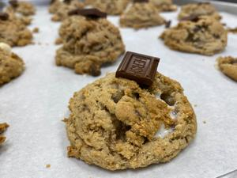
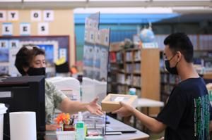
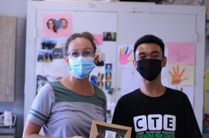
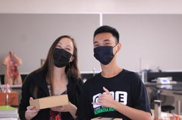

A leadership role I took on was during my senior year of high school when I led a CTE project focused on managing a commercial bakery. Before the project, I conducted extensive research on what it takes to run a bakery, from handling responsibilities and advertising to using the right tools and managing staff. The knowledge I gained was put to the test as I led my classmates in producing a large number of cookies for the school faculty, simulating a real-life mass production setting. My role was to instruct my peers on how to operate the bakery, ensuring that each step of the process ran smoothly. Although I was able to teach new skills and guide my classmates, I realized that I could improve my leadership by giving clearer instructions. On our first attempt, I made the mistake of not converting a recipe ahead of time, which caused confusion among the group. From that experience, I learned to prepare thoroughly and assign specific roles to each person to ensure efficiency. My cultural background as a Filipino, where fast-paced communication is common, may have contributed to this challenge, but it also taught me the importance of slowing down and explaining things clearly to others.

In college, I want to improve my public speaking and presentation skills. During high school presentations, I often found myself relying heavily on my phone or notes, which made my delivery seem less natural. My goal is to become more confident in presenting without having to reference notes constantly. I aim to internalize the information ahead of time so that I can speak more fluently and comfortably in front of an audience. This will not only make me a better presenter but also help me in future job interviews and professional settings, where clear and confident communication is essential. To achieve this, I plan to practice speaking from memory and focus on maintaining eye contact during presentations.

One local issue that has caught my attention is the lack of hospitality some Hawaii residents show toward tourists and newcomers. Hawaii is known for its "aloha spirit," yet I’ve noticed that some locals, especially during the pandemic, have expressed resentment toward visitors. Growing up as an Asian and Pacific Islander in Hawaii, I feel a deep connection to this issue. My family, like many other Asian families, came to Hawaii as immigrants in search of a better life, and I understand the feeling of being unwelcome in a new place. This lack of hospitality reminds me of the discrimination Asians faced in Hawaii during the Pearl Harbor attack. I believe that embracing the true meaning of aloha, by welcoming all people to our islands, fosters a more harmonious community. Martin Luther King Jr. is someone I admire for his dedication to creating equality and ending segregation. His leadership inspires me to advocate for inclusivity and to ensure that Hawaii remains a place where everyone feels welcomed.

