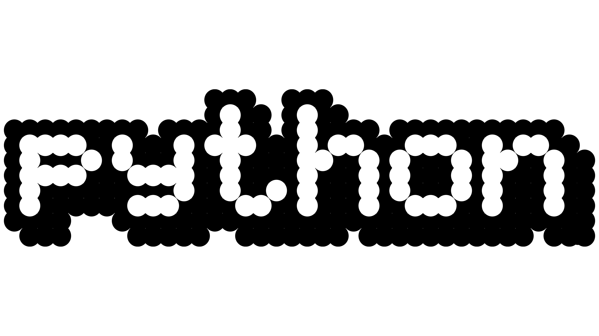

# Connecting Through Music: My Experience with the Jam Sesh-ion 🎶 Project

## What This Application Is About
<b>Jam Sesh-ion 🎶</b> is a web app created to connect students at the University of Hawaiʻi at Mānoa who love music. The idea came from noticing that while so many students have amazing musical talent, they don’t always have an easy way to find others with similar skills and interests. Because of this, many miss out on the chance to form meaningful connections or even dynamic performing groups. Jam Sesh-ion was designed to fix that by providing a platform for students to showcase their musical style, connect with others, and organize jam sessions easily.

The app allows users to create profiles to share their musical tastes, skills, and goals. They can also add links to their YouTube videos or SoundCloud tracks to give others a glimpse of their talent. Beyond just connecting people, the app has tools to manage jam sessions, show which sessions still have space, and make the process as fun and seamless as possible. Key features include:

- Profile Creation: Users can personalize profiles that highlight their unique musical style and skills.
- Media Sharing: You can upload YouTube or SoundCloud links to share your work.
- Session Management: Create, join, and manage jam sessions with visual indicators showing if there’s still room for more people.
- Community Building: Jam Sesh-ion makes it easy to connect with others who share your passion for music and creativity.
- The goal of Jam Sesh-ion is to make it easier for students to connect through their love of music, helping them build relationships, grow their skills, and even create lasting memories.

## How I Contributed
I contributed to Jam Sesh-ion 🎶 in several ways, from front-end development to improving user experience. Working on this project gave me the chance to combine technical skills with creativity to create something both useful and enjoyable.

- Front-End Development:
* Designed and styled pages like the user profiles, jam session views, and session creation page.
Focused on making the interface simple, intuitive, and visually appealing.
Improved navigation to help users explore and use the app more easily.

- Database Work:
* Helped design the Prisma schema to manage profile and session data efficiently.
Set up and migrated the database, including adding sample data to ensure the system worked smoothly.

- Adding Core Features:
* Built functionality so users could create, manage, and join jam sessions without any hassle.
Added a color-coded system to show whether a session was full or still had spots available, making it easier to plan participation.

- Incorporating Feedback:
 Collected and implemented feedback from users to improve the app. For example, we created an admin page for managing sessions and made profile features more interactive to keep users engaged.
Working on these features taught me how to balance technical development with user needs, ensuring the app was both functional and easy to use.

## Biggest Takeaways
Working on Jam Sesh-ion 🎶 was a great learning experience, and I took away so many lessons that I’ll carry forward into future projects.

- Teamwork Matters:
* I learned how important it is to work well with others. Dividing tasks, sharing updates, and solving problems as a team made everything more manageable and fun.

- Think About the User:
* Designing with the user in mind was a big part of this project. Listening to feedback and making adjustments based on real needs showed me how important it is to focus on who’s actually using the app.

- Building Technical Skills:
* I got hands-on experience with modern web tools like Prisma and Vercel and sharpened my front-end and back-end skills. It was rewarding to see all the pieces come together into a working app.

- Making an Impact:
* This project reminded me why I love building apps: they can bring people together, help them share their passions, and create something meaningful.

- Room for Growth:
* While the app works well, there’s so much potential for future improvements, like adding group chat, event scheduling, or expanded profile options. It’s exciting to think about what could come next.
Overall, working on Jam Sesh-ion 🎶 was an amazing experience that not only helped me grow as a developer but also gave me the chance to create something that connects people through music. It’s a project I’m really proud of, and it’s taught me so much about the kind of impact technology can have on building communities.
