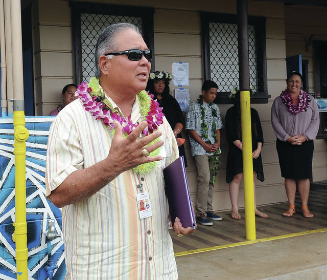

*"Hawaii County Managing Director and acting mayor Will Okabe congratulates Konawaena Middle School eighth grade students Friday for their work on their Kulia presentations. (Laura Ruminski/West Hawaii Today)"*

The 8th Kulia Project was a big part of my final year at Konawaena Middle School, where all eighth graders had to pick a real-world issue to research and present on. My group decided to focus on homelessness because it’s something we’ve all noticed happening in our community. Kulia i ka nu'u in Hawaiian translates to, "Strive For The Highest". Over several months, we spent a lot of time researching the causes of homelessness, how it affects individuals and society, and what’s currently being done to help. We looked into local statistics, spoke to people in our community, and studied programs that aim to reduce homelessness. Our goal was to create a well-researched and engaging presentation that would not only teach people about the issue but also encourage them to think about how they could help.

I was in charge of a lot of the research, especially around why homelessness happens and what resources are available locally, like shelters and aid programs. I also worked on creating the PowerPoint slides for our presentation, making sure they looked professional and included just the right amount of information. Our group worked together to make sure everything flowed smoothly, from who was going to speak when to how the slides were laid out. We practiced our presentation many times to get comfortable in front of an audience. On the day of our presentation, I was the first one to speak, which was nerve-wracking, but it also felt rewarding to set the stage for the rest of my group.

Through this project, I learned so many important skills that have helped me even after middle school. I got better at researching, finding reliable information, and putting it together in a way that made sense. I also learned how important teamwork is because we had to work together to make sure our project was a success. Presenting in front of a panel of teachers, classmates, and other adults really pushed me out of my comfort zone, but it also helped me gain confidence in public speaking. This project taught me how to present professionally, work with others, and manage a long-term project—all of which have been useful as I’ve continued through high school.

[Read more about the Kulia Project in West Hawaii Today](https://www.westhawaiitoday.com/2018/04/28/hawaii-news/analyze-this-konawaena-students-present-months-of-research-to-peers-panel/)

