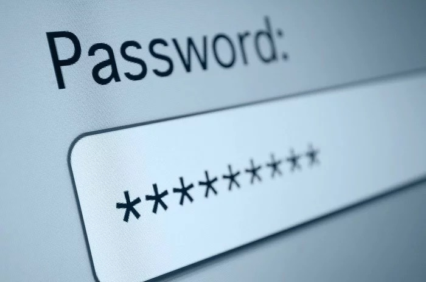

The code provided is a simple password enhancement program written in Python that I wrote during my first year of college. Python was my very second language I learn when it comes to coding, and this was one of the project challenges that I was proud of. It takes a word or phrase as input from the user and transforms it into a more secure version by replacing specific characters with more secure or symbolic alternatives. For example, it replaces lowercase "a" with "@", "s" with "$", and "i" with "1", among others. At the end, the program appends an exclamation mark to the transformed word to further enhance its strength as a password. This is a basic form of password masking or strengthening that mimics common security recommendations to use symbols and numbers in passwords.

The logic behind the program uses conditional statements and loops to iterate through each character of the input string, checking for the presence of specific characters, and replacing them with predefined symbols. Additionally, the first character of the string is capitalized to meet another common password security standard of using a mix of uppercase and lowercase letters. This approach allows for a straightforward yet effective transformation of basic text into a more secure format.

Overall, this project is a practical demonstration of how simple code can apply multiple security rules to an input string. The focus is on enhancing the security of user-provided text, which could be a password, by converting common characters into symbols or numbers. It’s a foundational exercise in both string manipulation and implementing security practices in programming, making it a useful learning project for beginners in Python.

### Password Python Code

## Here is a sample Python code with input Mypassword:

<pre><code>
# Get input from the user
word = input()

# Initialize an empty string to store the password
password = ''

# Convert the first character to uppercase
password += word[0].upper()

# Process the rest of the characters starting from index 1
for char in word[1:]:
    if char == 'm':
        password += 'M'
    elif char == 'i':
        password += '1'
    elif char == 'a':
        password += '@'
    elif char == 'B':
        password += '8'
    elif char == 's':
        password += '$'
    else:
        password += char

# Print the final password with an exclamation mark
print(password + '!')
</code></pre>

## Sample Python code taking the input of whatever password string the user inputs:

<pre><code>

# Get input from the user
word = input("Enter a word or phrase: ")

# Initialize an empty string to store the password
password = ''

# Process each character in the input
for char in word:
    if char == 'm':
        password += 'M'
    elif char == 'i':
        password += '1'
    elif char == 'a':
        password += '@'
    elif char == 'B':
        password += '8'
    elif char == 's':
        password += '$'
    elif char == 'e':
        password += '3'
    elif char == 'o':
        password += '0'
    elif char == 'l':
        password += '1'
    elif char == 't':
        password += '7'
    elif char == 'g':
        password += '9'
    else:
        password += char

# Print the final password with an exclamation mark
print(password + '!')

